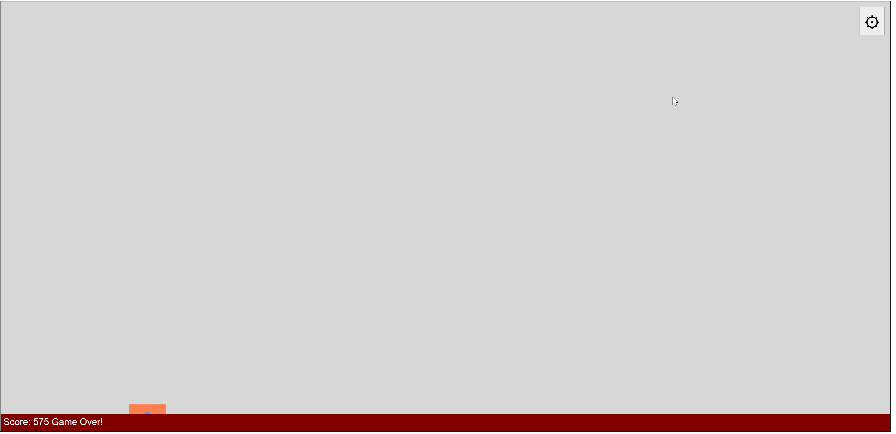
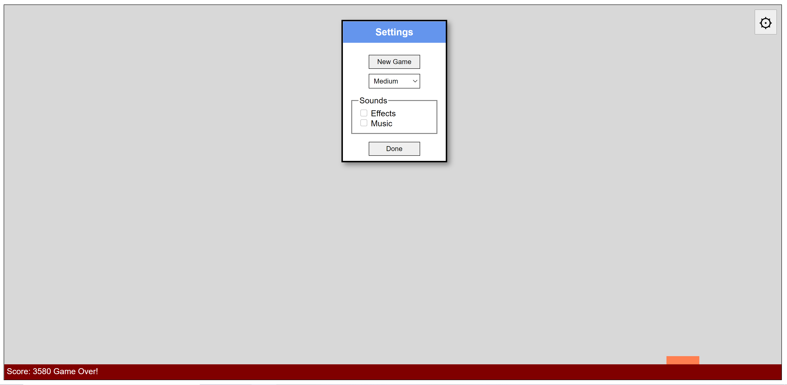

# Rebounce-Game-Development
This rebound game is solely built with Vanilla JavaScript. User is able to choose the difficulty levels which are categorised into Easy, Medium and Difficult. Users may also turn on the sound effects for a more pleasant user experience. The speed of the ball increases when it collides with the edge of the paddle to increase the difficulty. Game is over when ball touches the ground or misses the paddle. The paddle can be controlled by using both keyboard and mouse =)

## Learning Objectives  
  •	Creating game elements with HTML.
    •	Defining conditions with CSS.
    •	Defining objects with JavaScript.
    •	Creating replacement animation with JavaScript.
    •	Animating objects with formulas.
    •	Simulating boundary collisions.
    •	Handling keyboard events.
    •	Rendering game objects on screen.
    •	Detecting collisions.
    •	Managing difficulties.
    •  Adding event listeners for mobile events
    •	Testing the game on mobile emulators.
    •	Playing sound effects and music. 
    •	Adding game controls and deploying the game. 

## Getting Started
1. Download the source code. 
2. Run [rebound.html](/Rebounce-Game-Development/rebound.html).
3. Enjoy! 😃 

## Demos and Screenshot 

-----

  <h2>Gameplay</h2>

-----

  <h2>Settings Panel</h2>

-----

